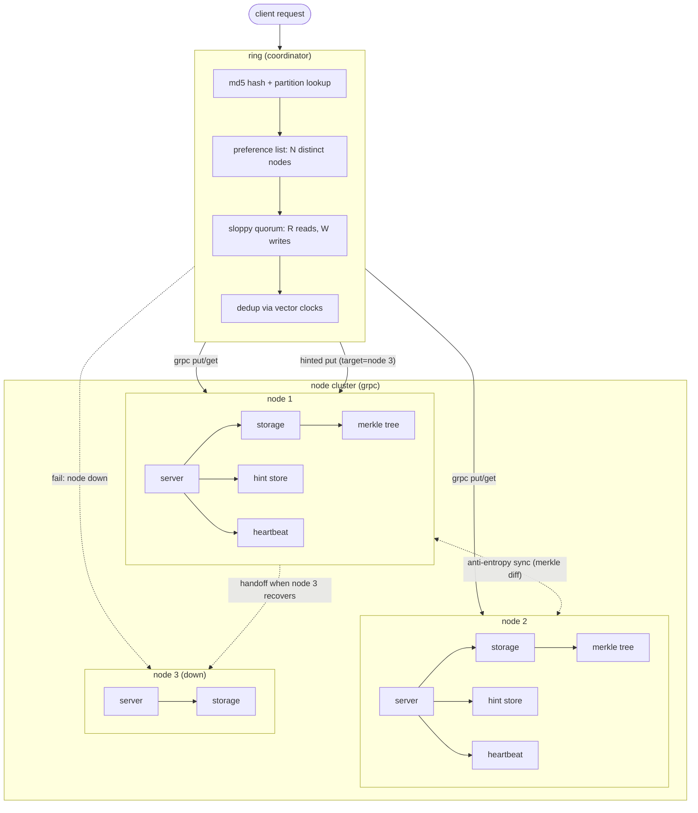
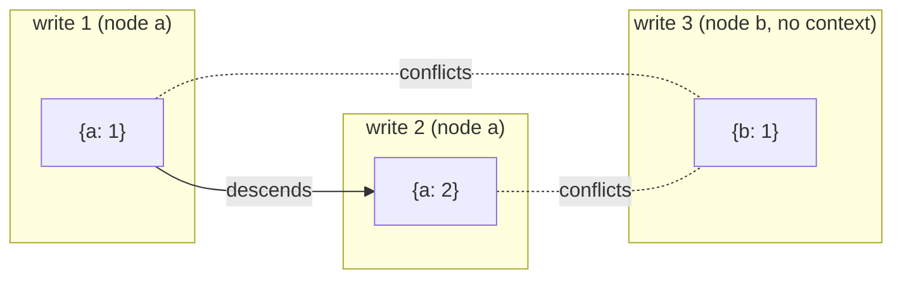
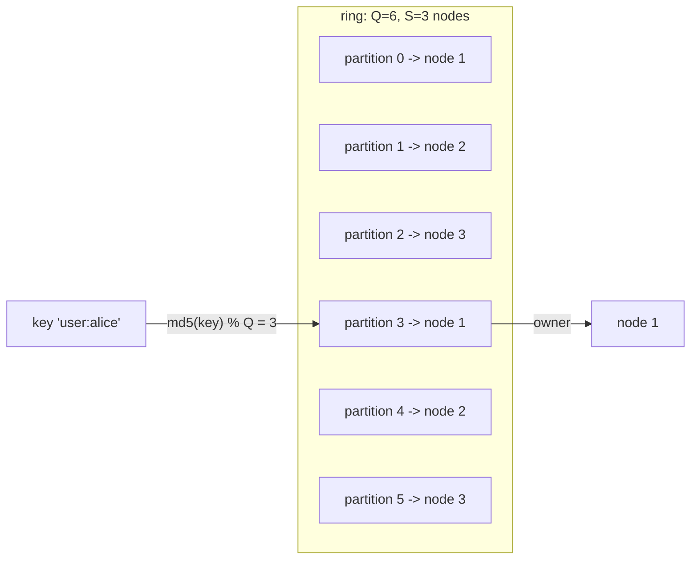
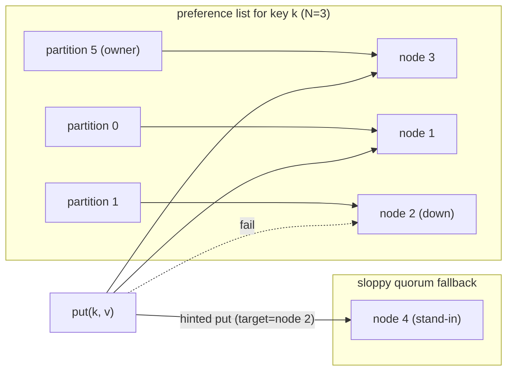
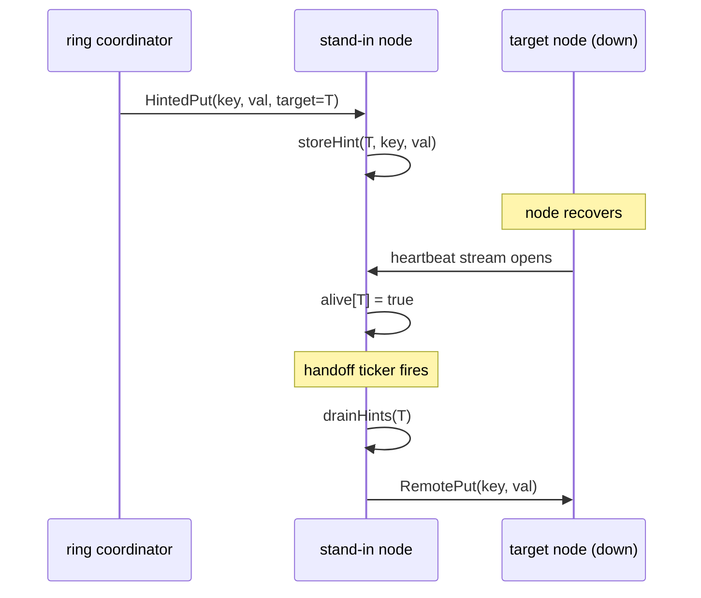
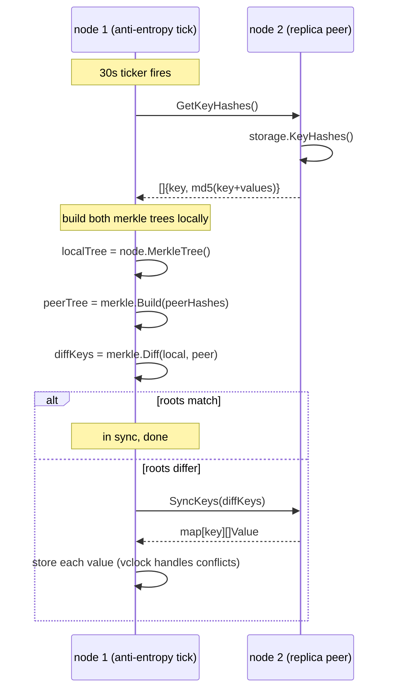

# plethora

a distributed key-value store built from scratch in go, following the amazon dynamo paper (decandia et al., 2007). uses strategy 3 consistent hashing with fixed equal-sized partitions, vector clocks for conflict detection, sloppy quorum with hinted handoff for high availability, merkle tree anti-entropy for replica synchronization, and grpc for inter-node communication.

built bottom-up, one layer at a time.

## architecture



## layers

started at the bottom and worked up. each layer was built, tested, and verified before moving on.

### layer 1: storage

the foundation. a thread-safe in-memory key-value store behind a read-write mutex. the interesting part is that it stores multiple versions per key as siblings. when a put comes in, storage uses vector clock logic to decide what to do:

- if the new value's clock descends from an existing value's clock, the old one is an ancestor. drop it.
- if an existing value's clock descends from the new one, the new write is stale. ignore it.
- if neither descends from the other, they conflict. keep both as siblings.

this means storage never loses data silently. conflicts are preserved and bubbled up to the caller.

### layer 2: node

wraps storage with identity. each node has an id, a network address, its own storage instance, and a hint store for hinted handoff. three write paths:

- `put(key, val, ctx)` is the standalone coordinator path. takes a raw string value and an optional vector clock context from a previous read. copies the clock, increments its own node id entry, builds a `types.Value`, and writes to storage. used for testing only, the ring has its own coordinator logic.
- `store(key, value)` is the replica path. accepts a fully built value with clock already set. just writes it to storage, no clock mutation.
- `storeHint(targetNodeID, key, value)` stores a value in the hint store (not in main storage) tagged with the node it was originally meant for. the hint store is a separate `map[string][]HintedItem` protected by its own mutex, so hinted data never shows up in gets.

`drainHints(targetNodeID)` atomically removes and returns all hints for a given node, used during handoff when the target recovers.

this separation matters because the ring coordinator builds the clock once, then replicates the same value to N nodes. replicas shouldn't touch the clock again. hinted data lives outside main storage entirely.

### layer 3: vector clocks

a `map[string]uint64` where keys are node ids and values are monotonic counters. tracks causal history across the distributed system.



five operations:

- **increment(nodeID)** bumps the counter for a node. called by the coordinator on every write.
- **descends(other)** returns true if every entry in other is <= the corresponding entry in this clock. means "i have seen everything you have seen". this is how we know if one value is a causal successor of another.
- **conflicts(other)** returns true when neither clock descends from the other. means two independent writes happened and we have a fork.
- **merge(other)** takes the pointwise max of both clocks. used to combine causal histories.
- **copy()** deep clones the map. critical because go maps are references, and without this you get aliasing bugs where mutating one clock silently corrupts another.

### layer 4: consistent hashing (strategy 3)

dynamo paper describes three strategies. we use strategy 3: Q equal-sized partitions, fixed forever. only ownership changes when nodes join or leave.



how it works:

- Q partitions are created at ring init and never change.
- partitions are assigned round-robin: partition i goes to node `i % S`.
- each node owns exactly `Q/S` partitions (Q must be divisible by S).
- to look up a key: `md5(key) % Q` gives the partition index, the partition's token gives the owner node id, the node map gives the node pointer in O(1).
- when a node joins or leaves, partitions are reassigned with the same round-robin. no data moves (yet), just ownership pointers change.

### layer 5: replication and sloppy quorum

a single owner isn't enough. we replicate each key to N nodes using a preference list, with sloppy quorum for availability when nodes go down.



the preference list walks the ring clockwise from the key's partition and collects N distinct nodes (skipping duplicates since multiple consecutive partitions might belong to the same node).

**put flow (sloppy quorum):**
1. coordinator (first node in preference list) copies the client's context clock, increments its own entry, builds the value.
2. tries to replicate to all N nodes via grpc.
3. if a preferred node is unreachable, finds the next node in the ring not in the preference list and sends a hinted put instead. the stand-in stores the value in its hint store tagged with the target node id.
4. counts acks (both direct puts and hinted puts). if acks >= W, success. otherwise quorum failure.

**get flow:**
1. reads from all N nodes in the preference list via grpc.
2. counts responses. if responses < R, quorum failure.
3. deduplicates: for every pair of values, if one's clock descends from the other, drop the ancestor. if clocks are identical, keep only one copy. what remains are causally distinct versions (siblings).

**quorum guarantee:** R + W > N ensures at least one node in the read set has the latest write. sloppy quorum relaxes "which W nodes" to include stand-ins, trading consistency for availability (the dynamo tradeoff). the demo uses N=3, R=2, W=2.

### layer 6: networking (grpc)

everything above this was in-process function calls. grpc makes it real.

```
proto/kv.proto defines:
    service KV {
        rpc Put(PutRequest) returns (PutResponse)
        rpc Get(GetRequest) returns (GetResponse)
        rpc HintedPut(HintedPutRequest) returns (PutResponse)
        rpc Heartbeat(stream HeartbeatMessage) returns (stream HeartbeatMessage)
        rpc GetKeyHashes(GetKeyHashesRequest) returns (GetKeyHashesResponse)
        rpc SyncKeys(SyncKeysRequest) returns (SyncKeysResponse)
    }
```

- **server**: each node runs a grpc server. Put calls `node.Store()`, Get calls `node.Get()`, HintedPut calls `node.StoreHint()`. the Heartbeat handler is a bidirectional stream for failure detection. GetKeyHashes returns the node's key-hash pairs for merkle tree comparison. SyncKeys returns actual values for a set of keys. each server also tracks a peers map (nodeID -> addr), an alive map updated by heartbeats, and a replica peers list for anti-entropy.
- **client**: `RemotePut`, `RemoteGet`, `RemoteHintedPut`, `RemoteGetKeyHashes`, and `RemoteSyncKeys`. dial the node's address, make the rpc, convert proto back to types.
- **ring**: `ring.Put` and `ring.Get` use grpc client calls. on put failure, the ring falls back to `RemoteHintedPut` on a stand-in node. `ReplicaPeers` computes which nodes share key ranges for anti-entropy.

the ring tests start real grpc servers on random OS-assigned ports and exercise the full put/get path including sloppy quorum.

### layer 7: hinted handoff

when a preferred node goes down, the stand-in holds hints temporarily. the handoff mechanism gets them back to the right place.



- each server runs a background `runHandoff` goroutine on a 5-second ticker.
- on each tick, it iterates the alive map. for every node marked alive, it drains all pending hints and forwards them via `RemotePut`.
- the heartbeat is a bidirectional grpc stream. as long as messages flow, the peer is alive. when the stream breaks (recv error), the peer is marked dead.
- hints live in the node's `HintStore`, a `map[string][]HintedItem` separate from main storage. they never show up in gets. `drainHints` atomically removes and returns all items for a target, so each hint is forwarded exactly once.

### layer 8: merkle trees (anti-entropy sync)

hinted handoff handles temporary failures, but what about replicas that silently drift apart? missed writes, partial failures, bugs. anti-entropy catches everything else.



the merkle tree is a binary hash tree built bottom-up from sorted key-hash pairs:

1. each leaf is a key hashed with all its values: `md5(key + value1 + value2 + ...)`.
2. entries are sorted by key for determinism, padded to the next power of 2.
3. parent hash = `md5(left.hash + right.hash)`, merged bottom-up to a single root.
4. if two trees have the same root hash, all data is identical. if roots differ, walk down to find exactly which leaves diverged in O(log n) comparisons instead of O(n).

the node caches its merkle tree with a dirty flag. every write marks it dirty; `MerkleTree()` rebuilds lazily only when someone asks for it after data changed.

anti-entropy only syncs with **replica peers**, nodes that share at least one key range. `ring.ReplicaPeers(nodeID)` walks all partitions and collects nodes that appear in the same preference lists. each server round-robins through its replica peers, one per tick, so every peer gets checked periodically.

the merkle tree never goes over the wire. only flat key-hash pairs and actual values do. the tree is a local optimization to narrow down divergence efficiently.

## project structure

```
plethora/
    types/       core types: Key, Value (with vector clock)
    vclock/      vector clock implementation
    storage/     thread-safe versioned kv store, KeyHashes for merkle trees
    node/        node with identity, storage, hint store, cached merkle tree
    merkle/      merkle tree: Build, Diff, collectKeys
    ring/        consistent hash ring, sloppy quorum, replication, dedup, ReplicaPeers
    server/      grpc server: put, get, hinted put, heartbeat, handoff, anti-entropy
    client/      grpc client helpers (RemotePut, RemoteGet, RemoteHintedPut, RemoteGetKeyHashes, RemoteSyncKeys)
    proto/       protobuf definition and generated code
    cmd/         demo: boots 10 nodes, puts and gets over grpc
```

## running it

```bash
go test ./...         # run all tests (29 total, includes sloppy quorum test)
go run ./cmd/         # boot 10 nodes on random ports, run demo puts and gets
```

## dynamo paper coverage

| concept | status |
|---|---|
| consistent hashing (strategy 3) | done |
| vector clocks | done |
| replication (preference list) | done |
| quorum (R, W, N) | done |
| grpc networking | done |
| sloppy quorum | done |
| hinted handoff | done |
| heartbeat failure detection (bidir stream) | done |
| merkle trees (anti-entropy sync) | done |
| gossip protocol (membership) | next |

## config

the ring takes four parameters:

- **Q** total partitions (must be divisible by number of nodes)
- **N** replication factor (how many nodes store each key)
- **R** minimum read responses for quorum
- **W** minimum write acks for quorum

the demo uses Q=20, N=3, R=2, W=2 across 10 nodes.
