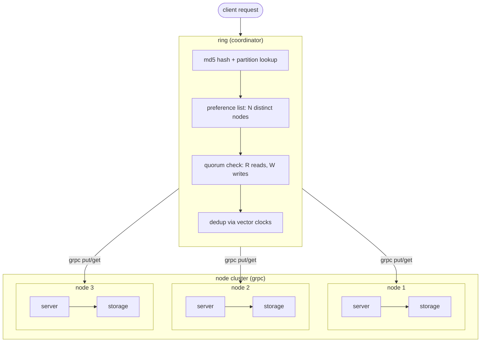
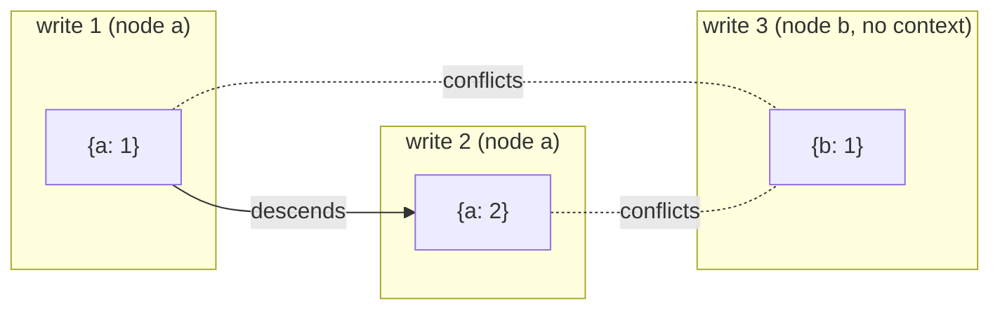
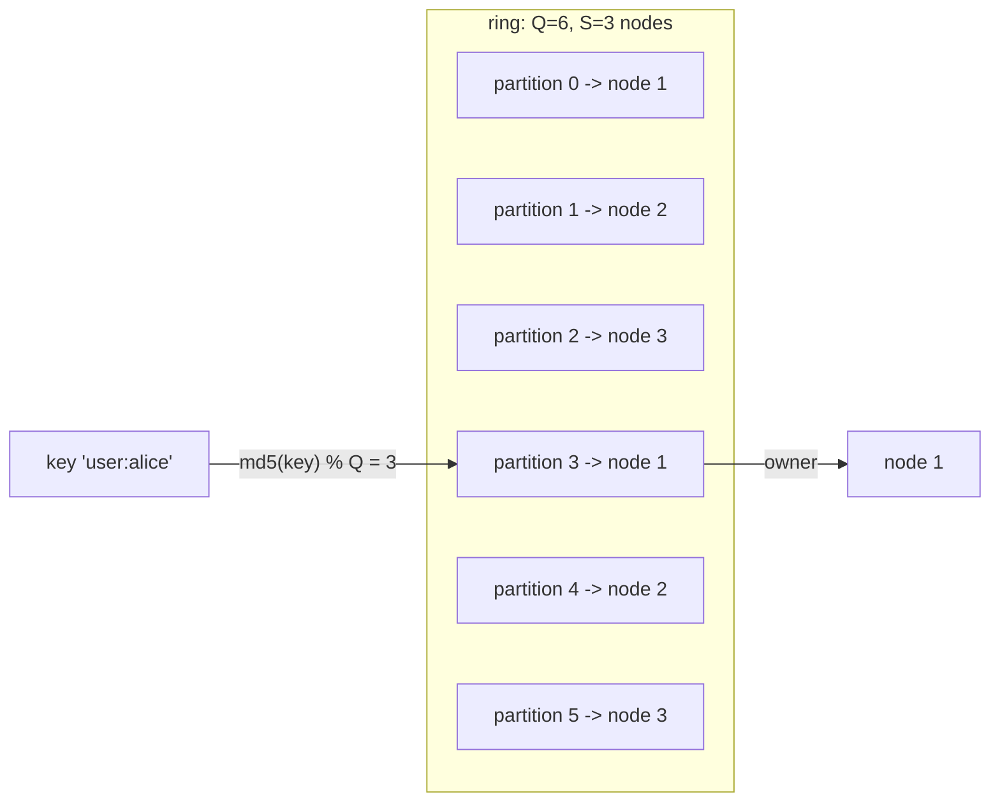
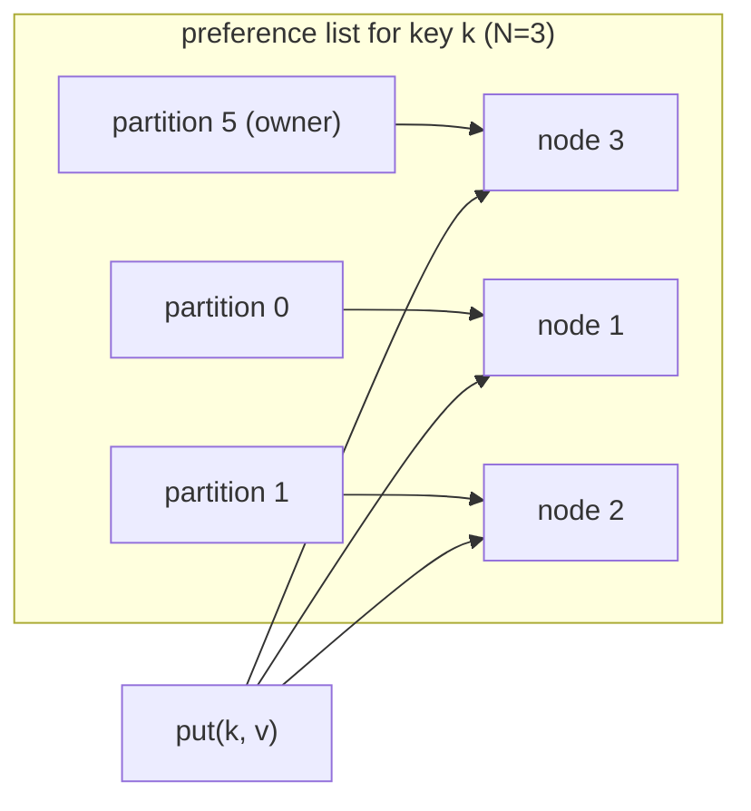

# plethora

a distributed key-value store built from scratch in go, following the amazon dynamo paper (decandia et al., 2007). uses strategy 3 consistent hashing with fixed equal-sized partitions, vector clocks for conflict detection, quorum-based replication, and grpc for inter-node communication.

built bottom-up, one layer at a time.

## architecture



## layers

started at the bottom and worked up. each layer was built, tested, and verified before moving on.

### layer 1: storage

the foundation. a thread-safe in-memory key-value store behind a read-write mutex. the interesting part is that it stores multiple versions per key as siblings. when a put comes in, storage uses vector clock logic to decide what to do:

- if the new value's clock descends from an existing value's clock, the old one is an ancestor. drop it.
- if an existing value's clock descends from the new one, the new write is stale. ignore it.
- if neither descends from the other, they conflict. keep both as siblings.

this means storage never loses data silently. conflicts are preserved and bubbled up to the caller.

### layer 2: node

wraps storage with identity. each node has an id, a network address, and its own storage instance. two write paths:

- `put(key, val, ctx)` is the coordinator path. takes a raw string value and an optional vector clock context from a previous read. copies the clock, increments its own node id entry, builds a `types.Value`, and writes to storage.
- `store(key, value)` is the replica path. accepts a fully built value with clock already set. just writes it to storage, no clock mutation.

this separation matters because the ring coordinator builds the clock once, then replicates the same value to N nodes. replicas shouldn't touch the clock again.

### layer 3: vector clocks

a `map[string]uint64` where keys are node ids and values are monotonic counters. tracks causal history across the distributed system.



five operations:

- **increment(nodeID)** bumps the counter for a node. called by the coordinator on every write.
- **descends(other)** returns true if every entry in other is <= the corresponding entry in this clock. means "i have seen everything you have seen". this is how we know if one value is a causal successor of another.
- **conflicts(other)** returns true when neither clock descends from the other. means two independent writes happened and we have a fork.
- **merge(other)** takes the pointwise max of both clocks. used to combine causal histories.
- **copy()** deep clones the map. critical because go maps are references, and without this you get aliasing bugs where mutating one clock silently corrupts another.

### layer 4: consistent hashing (strategy 3)

dynamo paper describes three strategies. we use strategy 3: Q equal-sized partitions, fixed forever. only ownership changes when nodes join or leave.



how it works:

- Q partitions are created at ring init and never change.
- partitions are assigned round-robin: partition i goes to node `i % S`.
- each node owns exactly `Q/S` partitions (Q must be divisible by S).
- to look up a key: `md5(key) % Q` gives the partition index, the partition's token gives the owner node id, the node map gives the node pointer in O(1).
- when a node joins or leaves, partitions are reassigned with the same round-robin. no data moves (yet), just ownership pointers change.

### layer 5: replication and quorum

a single owner isn't enough. we replicate each key to N nodes using a preference list.



the preference list walks the ring clockwise from the key's partition and collects N distinct nodes (skipping duplicates since multiple consecutive partitions might belong to the same node).

**put flow:**
1. coordinator (first node in preference list) copies the client's context clock, increments its own entry, builds the value.
2. replicates the same value to all N nodes via grpc.
3. counts acks. if acks >= W, success. otherwise quorum failure.

**get flow:**
1. reads from all N nodes in the preference list via grpc.
2. counts responses. if responses < R, quorum failure.
3. deduplicates: for every pair of values, if one's clock descends from the other, drop the ancestor. if clocks are identical, keep only one copy. what remains are causally distinct versions (siblings).

**quorum guarantee:** R + W > N ensures at least one node in the read set has the latest write. the demo uses N=3, R=2, W=2.

### layer 6: networking (grpc)

everything above this was in-process function calls. grpc makes it real.

```
proto/kv.proto defines:
    service KV {
        rpc Put(PutRequest) returns (PutResponse)
        rpc Get(GetRequest) returns (GetResponse)
    }
```

- **server**: each node runs a grpc server. the Put handler calls `node.Store()` (replica path). the Get handler calls `node.Get()`. thin wrappers with proto-to-types conversion.
- **client**: two functions, `RemotePut` and `RemoteGet`. dial the node's address, make the rpc, convert proto back to types.
- **ring**: `ring.Put` and `ring.Get` were swapped from direct `node.Store()`/`node.Get()` calls to `client.RemotePut()`/`client.RemoteGet()` calls. the coordinator logic (clock building, quorum checking, dedup) stayed exactly the same.

the ring tests start real grpc servers on random OS-assigned ports and exercise the full put/get path over the wire.

## project structure

```
plethora/
    types/       core types: Key, Value (with vector clock)
    vclock/      vector clock implementation
    storage/     thread-safe versioned kv store
    node/        node with identity, storage, and grpc address
    ring/        consistent hash ring, replication, quorum, dedup
    server/      grpc server wrapping a node
    client/      grpc client helpers (RemotePut, RemoteGet)
    proto/       protobuf definition and generated code
    cmd/         demo: boots 10 nodes, puts and gets over grpc
```

## running it

```bash
go test ./...         # run all tests (28 total, ring tests start real grpc servers)
go run ./cmd/         # boot 10 nodes on random ports, run demo puts and gets
```

## dynamo paper coverage

| concept | status |
|---|---|
| consistent hashing (strategy 3) | done |
| vector clocks | done |
| replication (preference list) | done |
| quorum (R, W, N) | done |
| grpc networking | done |
| sloppy quorum + hinted handoff | next |
| merkle trees (anti-entropy sync) | next |
| gossip protocol (failure detection + membership) | next |

## config

the ring takes four parameters:

- **Q** total partitions (must be divisible by number of nodes)
- **N** replication factor (how many nodes store each key)
- **R** minimum read responses for quorum
- **W** minimum write acks for quorum

the demo uses Q=20, N=3, R=2, W=2 across 10 nodes.
